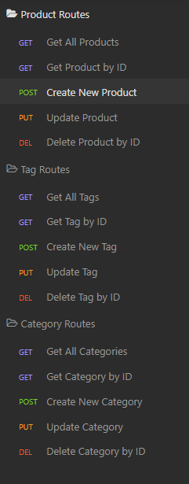

# Sequelize Back End

## Description

- Motivation for this project: This application sets out the bones for an API functionality to search and edit a database.
- Reason for this project: This program provides a functioning back end for a website accessing a database.
- Problem(s) solved by this project: This enables a website to access a database so that data can be stored in a database rather than in a browser.
- Lessons learned: I learned how to use Sequelize to help with the functionality of a RESTful API.

## Table of Contents

- [Installation](#installation)
- [Usage](#usage)
- [Tests](#tests)
- [Contributing](#contributing)
- [Questions](#questions)

## Installation

To install the application, navigate to the "./Develop" folder on your command line, and enter the command:
```
npm i
```
in order to install the required dependencies for the application to function correctly.

Create a ".env" file with the following, according to your "mySQL" user requirements:
```
DB_NAME='ecommerce_db'
DB_PASSWORD='<enter your password, or leave blank if you have none>'
DB_USER='<enter your mySQL username>'
```

On the command line, use the command:
```
mysql -u <enter your mySQL username> -p < ./db/schema.sql
```
You will be prompted for your mySQL password and it should create the database you need to properly run the application.

Next, on the command line, use the command:
```
npm run seed
```
in order to seed our database with test tables to verify our code.


## Usage

To start the application, you can use the command:
```
npm run start
```
or:
```
npm run watch
```
to start the application with "nodemon" dependency functionality.

## Tests

I utilized [Insomnia](https://insomnia.rest/) to test the functionality of this program with GET, POST, PUT, and DELETE requests.



Each route can be broken down as follows:

GET ALL routes
```
http://localhost:3001/api/<products, tags, or categories>
```

GET by ID routes
```
http://localhost:3001/api/<products, tags, or categories>/<id number of requested item>
```

POST (or create) new item
```
http://localhost:3001/api/<products, tags, or categories>
```

PUT (or update) item
```
http://localhost:3001/api/<products, tags, or categories>/<id number of requested item>
```

DELETE item
```
http://localhost:3001/api/<products, tags, or categories>/<id number of requested item>
```

When you are creating Products:
```
"product_name", "price", "stock"
```
are required items.
```
"tagIds"
```
can be single numbers, or an array of numbers corresponding to the new or updated products Tag IDs.

When you are creating Tags:
```
"tag_name"
```
is required.

When you are creating Categories:
```
"category_name"
```
is required.

## Contributing

If you would like to contribute to this project, please email me.


## Questions

- [GitHub profile](https://www.github.com/Hostile131)
- [actuallysmart@yahoo.com](mailto:actuallysmart@yahoo.com)